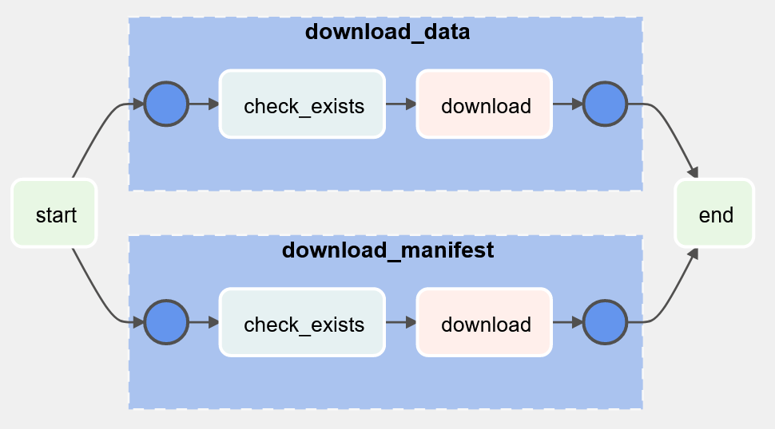

[](https://data-dag.readthedocs.io/en/latest/?badge=latest) 

# Overview

`data-dag` is a library for writing data-defined Airflow DAGs and operators.

# Installation

```pip install data-dag```

# Example

Re-usable operator and DAG template can be stored in a central location, such as a custom Airflow plugin (or a package within `dags/` works fine too):

```python
# plugins/my_factories/download.py

from data_dag.operator_factory import OperatorFactory
from data_dag.dag_factory import DagFactory

from urllib.request import urlretrieve
from typing import List
from airflow.operators.dummy import DummyOperator
from airflow.providers.http.sensors.http import HttpSensor
from airflow.operators.python import PythonOperator
from airflow.utils.task_group import TaskGroup


class DownloadOperator(OperatorFactory):
    """An operator factory for safely downloading files to a known location"""

    name: str
    url: str
    path: str

    def make_operator(self):
        with TaskGroup(group_id=f'download_{self.name}') as group:
            check = HttpSensor(
                task_id='check_exists',
                endpoint=self.url
            )
            download = PythonOperator(
                task_id=f'download',
                python_callable=lambda: urlretrieve(self.url, self.path)
            )
            check >> download

        return group


class DownloaderDag(DagFactory):
    """A DAG factory for producing simple DAGs that just download a bunch of files"""

    downloads: List[DownloadOperator]

    def _make_dag(self):
        start = DummyOperator(task_id='start')
        end = DummyOperator(task_id='end')

        for download in self.downloads:
            start >> download.make_operator() >> end
```

Then a definition for a particular DAG can live in a data file:

```yaml
# dags/yaml/sample_dag.yaml

dag_id: sample_dag
description: An example of how to write a data-driven DAG
schedule_interval: '@daily'
start_date: '2020-01-01T00:00:00'
downloads:
- name: data
  url: https://www.example.com/data.zip
  path: data.zip
- name: manifest
  url: https://www.example.com/manifest.json
  path: manifest.json
```

That data file can then be loaded into a DAG. Per Airflow's requirements, this must be done in a file located in `dags/` and the result must be saved into a uniquely named global variable. The simplest possible example is this:

```python
# dags/sample_dag.py

from yaml import safe_load
from my_factories.download import DownloaderDag

with open('yaml/sample_dag.yaml', 'r') as f:
    dag_data = safe_load(f)

dag = DownloaderDag.parse_obj(dag_data).make_dag()
```



## Multiple DAGs

Obviously, using a template isn't much use if you only fill it in once. Here's a simple example of a loader that will load any number of YML files from a folder and publish each one as a DAG in Airflow:

```python
# dags/load_yml_files.py

from pathlib import Path
from airflow import DAG
import yaml
from my_factories import BaseDag

dag_dir = Path(__file__).parent

# For each YAML file in a particular directory...
for yaml_file_path in dag_dir.glob('typical_dags/**.yml'):
    with open(yaml_file_path) as f:
        dag_metadata = yaml.safe_load(f)

    # ... generate a DAG from that metadata
    dag_metadata_obj = BaseDag.parse_obj(dag_metadata)
    dag = dag_metadata_obj.make_dag()

    # See https://www.astronomer.io/guides/dynamically-generating-dags/
    dag_name = yaml_file_path.with_suffix('').name
    globals()[dag_name] = dag
```

# Documentation

[Complete docs can be found here](https://data-dag.rtfd.org/)

[//]: # (TODO)
[//]: # (- Add DAG loader factory to enable a 2-liner DAG python file
[//]: # (- Add dependency group mixin or something )
