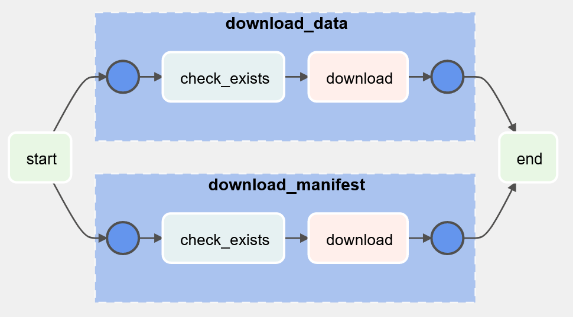

(overview_base)=
# Overview

`data-dag` provides a variety of tools to simplify the process of writing data-defined Airflow DAGs. This library was created to simplify and formalize the approach introduced [in this article](https://engineering.rearc.io/posts/2022_05_09-airflow_operator_factory_pattern/).

This approach is incredibly useful when writing a large number of DAGs that rely, either in part or entirely, on shareable primitives. A primitive may or may not be a single Airflow operator. For example, you might want the following primitive to only create a table if it doesn't exist:

```{mermaid}
graph LR
    a["Check if table exists"] --> b["Create table (all_failed)"] --> c["Done (one_success)"]
    a --> c
```

While it is certainly possible to write a more complicated operator that performs this logic, it's often easier, clearer, and more maintainable to work with existing operators. Additionally, writing factories like this is easy to stack to build multiple levels of abstractions, or to re-use components across multiple different abstractions.

This pattern, in addition to simplifying and standardizing how multiple DAGs can be defined, also provides a framework for writing re-usable abstractions and operator compositions (for example, as a shareable plugin). This is because factories defined using `data-dag` can be defined in-code too, not just using data.

`data-dag` is written on top of the excellent [`pydantic` library](https://pydantic-docs.helpmanual.io/), providing automatic type coercion, field validation, and serialization and deserialization against a variety of data formats.

## Example

Re-usable operator and DAG template can be stored in a central location, such as a custom Airflow plugin (or a package within `dags/` works fine too):

(example_dag)=
```python
# plugins/my_factories/download.py

from data_dag.operator_factory import OperatorFactory
from data_dag.dag_factory import DagFactory

from urllib.request import urlretrieve
from typing import List
from airflow.operators.dummy import DummyOperator
from airflow.providers.http.sensors.http import HttpSensor
from airflow.operators.python import PythonOperator
from airflow.utils.task_group import TaskGroup


class DownloadOperator(OperatorFactory):
    """An operator factory for safely downloading files to a known location"""

    name: str
    url: str
    path: str

    def make_operator(self):
        with TaskGroup(group_id=f'download_{self.name}') as group:
            check = HttpSensor(
                task_id='check_exists',
                endpoint=self.url
            )
            download = PythonOperator(
                task_id=f'download',
                python_callable=lambda: urlretrieve(self.url, self.path)
            )
            check >> download

        return group


class DownloaderDag(DagFactory):
    """A DAG factory for producing simple DAGs that just download a bunch of files"""

    downloads: List[DownloadOperator]

    def _make_dag(self):
        start = DummyOperator(task_id='start')
        end = DummyOperator(task_id='end')

        for download in self.downloads:
            start >> download.make_operator() >> end
```

Then a definition for a particular DAG can live in a data file:

```yaml
# dags/yaml/sample_dag.yaml

dag_id: sample_dag
description: An example of how to write a data-driven DAG
schedule_interval: '@daily'
start_date: '2020-01-01T00:00:00'
downloads:
- name: data
  url: https://www.example.com/data.zip
  path: data.zip
- name: manifest
  url: https://www.example.com/manifest.json
  path: manifest.json
```

That data file can then be loaded into a DAG. Per Airflow's requirements, this must be done in a Python file located in `dags/` and the result must be saved into a uniquely named global variable. The simplest possible example is this:

```python
# dags/sample_dag.py

from yaml import safe_load
from my_factories.download import DownloaderDag

with open('yaml/sample_dag.yaml', 'r') as f:
    dag_data = safe_load(f)

dag = DownloaderDag.parse_obj(dag_data).make_dag()
```



## Multiple DAGs

Obviously, using a template isn't much use if you only fill it in once. Here's a simple example of a loader that will load any number of YML files from a folder and publish each one as a DAG in Airflow:

(loader_script)=
```python
# dags/load_yml_files.py

from pathlib import Path
from airflow import DAG
import yaml
from my_factories import BaseDag

dag_dir = Path(__file__).parent

# For each YAML file in a particular directory...
for yaml_file_path in dag_dir.glob('typical_dags/**.yml'):
    with open(yaml_file_path) as f:
        dag_metadata = yaml.safe_load(f)

    # ... generate a DAG from that metadata
    dag_metadata_obj = BaseDag.parse_obj(dag_metadata)
    dag = dag_metadata_obj.make_dag()

    # See https://www.astronomer.io/guides/dynamically-generating-dags/
    globals()[dag_metadata_obj.dag_id] = dag
```

## Use Cases

### Custom No-Code DAGs

Defining dataflows without Python code means that anyone can write a dataflow, not just programmers.

Since the abstractions are easy to write, or can be readily shared with plugins, it's straightforward to come up with the abstractions useful to your business case. Focus your DAG authoring on what matters to you, and abstract away everything else.

### Write and upgrade DAGs centrally

The actual DAG code that Airflow sees is generated by shared Python code. That means you can write abstractions once and re-use them multiple times in a standard pattern. Also, if a pattern is later discovered to be lacking, or needs extra features, it can be upgraded in-place and all DAGs that rely on it will automatically be upgraded.

This also provides a standard way for testing DAGs, since now DAGs are composed of components which can more easily be unit tested.

### Re-use patterns, not just operators

Operators are great, and custom operators aren't hard to write, but often more complicated tasks are better defined as patterns of operators rather than complicated single operators. By relying on a factory pattern rather than expecting data to map directly to operators, data-driven DAGs maintain transparency in the DAG's execution without requiring that the DAG authoring itself be complicated.

### Secure DAG authoring

If desired, direct Python access to the DAGs folder can be restricted and only data-driven DAGs may be submitted by authors to a different location. This would allow a small number of admins to control the exact code and configuration of execution on the Airflow server without limiting the ability of various external authors to contribute business-relevant dataflows.

### Generate DAGs without code generation

Some DAGs are best generated by code, e.g. to loop through a long list of URLs or to leverage data in a database. With Airflow, this must either occur within an operator in a static DAG or at DAG creation time. Using data-driven DAGs makes it easy to programmatically generate the DAG by having some code generate and export a data file.

```{note}
Non DAG-oriented orchetsration engines, such as Prefect, don't necessarily have this same limitation. However, DAGs have a tremendous number of advantages in many ways and remain heavily used industry-wide, so empowering their use is worthwhile despite such limitations.
```

### Introspect dataflows

There are a variety of reasons it may be helpful to analye the dataflows deployed on a given Airflow server. Perhaps for refactoring, or for determining feature usage, or to figure out which dataflows interact with which files. Whatever the reason, this is normally near-impossible to automate since each DAG is arbitrary Python code that produces complicated, Airflow-specific objects. With data-driven DAGs, though, it's trivial to open the data files and investigate them; this can be done either directly, on the dictionaries, lists, etc. represented by the data files, or by loading them into their appropriate metadata objects and introspecting those. All this can be done without needing Airflow to be running at all, since no operators or DAGs need be generated in this process.

### And you can still write Python DAGs too

Interested, but not able or interested in diving head-first into using data-driven DAGs? There's no need to make any sort of commitment. All factories can be used by themselves, piecemeal, either instantiated from data or from code. It doesn't matter. The design put forward by `data-dag` only enables data-driven DAGs, but it's little more than a standard way of mapping minimal, business-specific metadata into Airflow constructs. Re-use your abstractions within Python DAGs, use standard Airflow operators within a DAG factory, or whatever is simplest for you. Let some DAGs be fully data-defined, and others be custom-written. Whatever works best for your use case: using `data-dag` only simplifies your DAG authoring, it doesn't in any way limit how you do so.
